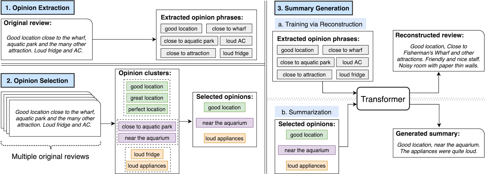

# OpinionDigest

This repository contains the codebase of our paper [OpinionDigest A Simple Framework for Opinion Summarization](https://arxiv.org/abs/2005.01901) accepted at [ACL 2020](https://acl2020.org/).


OpinionDigest is an **unsupervised opinion summarization framework** that generates a summary from multiple review documents without requiring any gold-standard summary. 
OpinionDigest relies on an aspect-based sentiment classification model, which extracts opinions from input reviews, to train a seq2seq model that generates a summary from a set of opinions.
This framework enables the user to easily control the output by filtering input opinions using aspects and/or sentiment polarity.
  


Please see [our paper](https://arxiv.org/abs/2005.01901) for details. Please also try our [online demo](http://extremereader.megagon.info/).  

This project is a collaboration with the Natural Language Processing Group at the University of Edinburgh ([EdinburghNLP](https://edinburghnlp.inf.ed.ac.uk/)).

## Installation

```
$ git clone https://github.com/megagonlabs/opiniondigest.git
$ cd opiniondigest
$ pip install -r requirements.txt
``` 

## (Optional) Data and Pre-trained model

To download data and pre-trained model files, run the command below.
```
$ ./download.sh
```

The script downloads the following files.
```
├── data
│   └── yelp-default
│       ├── dev.csv
│       ├── summaries_0-200_cleaned_fixed_business_ids.csv
│       ├── test.csv
│       ├── test_gold.csv
│       ├── test_gold_8_15_all_all_300_8.csv
│       ├── train.csv
│       └── yelp.jsonl
└── model
    ├── yelp-default_op2text_default.pt
    ├── yelp-default_op2text_default_ID.field
    ├── yelp-default_op2text_default_IN_TEXT.field
    └── yelp-default_op2text_default_OUT_TEXT.field
```

- `{train|dev|test}.csv`: Training/development/test data
- `summaries_0-200_cleaned_fixed_business_ids.csv`: Processed version of gold-standard summaries of the Yelp dataset, originally created by [MeanSum](https://github.com/sosuperic/MeanSum). We fixed a minor issue with business ID.
- `test_gold_8_15_all_all_300_8.csv`: This file contains input reviews, extractions, and gold-standard summary for each entity.
- `yelp.jsonl`: Opinion phrases extracted by by [Snippext](https://github.com/rit-git/Snippext_public) from the Yelp dataset.
- `model/`: PyTorch checkpoint and "pickled" torchtext files for tokenizer that are used for the experiments in the paper.


## Preprocessing

To run our framework, you need to preprocess your dataset and extract opinion phrases from the input sentences. You can use any ABSA models to perform the extraction task. 

For our experiment on [Yelp](https://www.yelp.com/dataset) dataset, we used [this extractor (Snippext)](https://github.com/rit-git/Snippext_public) to extract opinions from the reviews.

Please follow [our example](example/yelp_extractions_example.jsonl) to format your extraction files.


## Running

The workflow has following 4 steps.
You can configure the settings of each step by creating JSON file. 

- Step 1. Data preparation
- Step 2. Training
- Step 3. Aggregation
- Step 4. Generation

You can skip Steps 1-3 by downloading our pre-trained model and dataset.


### Step 1. Data preparation

```
$ python src/prepare.py \
  config/prepare_{p_name}.json
```

The script will create training/development/test datasets.

```
$ ls data/{p_name}
train.csv
dev.csv
test.csv
```


### Step 2. Training

To train a model, run the following script with configurations files for preparation and training. 

```
$ python src/train.py \
  config/prepare_{p_name}.json \
  config/train_{t_name}.json
```

The training script saves following model files.

```
$ ls model
{p_name}_op2text_{t_name}.model
{p_name}_op2text_{t_name}_IN_TEXT.field
{p_name}_op2text_{t_name}_OUT_TEXT.field
{p_name}_op2text_{t_name}_ID.field
```

### Step 3. Aggregation

```
$ python src/aggregate.py \
  config/aggregate_{a_name}.json \
  config/prepare_{p_name}.json \
  config/train_{t_name}.json
```

The script generates following three files.

```
$ ls data/{p_name}
aggregate_{a_name}.csv
```

Here `p_name` needs to be specified in the configuration file `aggregate_{a_name}.json`.
`a_name` is generated from the parameters `_n_k_att_pol`:
- `n` is the number of reviews;
- `k` is the top-k frequent extractions;
- `att` is the attribute of the extractions;
- `pol` is the sentiment polarity of the extractions.


### Step 4. Generation

To generate summaries using OpinionDigest model, run the command below:    

```
$ python src/generate.py \
  config/prepare_{p_name}.json \
  config/train_{t_name}.json \
  config/aggregate_{a_name}.json \
  config/generate_{g_name}.json
```

This will creates following output and log files. 

```
$ ls output
{p_name}_op2text_{t_name}_{g_name}.csv
{p_name}_op2text_{t_name}_{g_name}.log
```


### Evaluation

```
$ python src/evaluate.py \
  config/prepare_yelp-default.json \
  config/train_tiny.json \
  config/aggregate_default.json \
  config/generate_beam.json
```

```
$ cat output/default_op2text_default_greedy.eval
bleu,0.06273896942347468
rouge_1,0.4166751301989266
rouge_2,0.1566288226261539
rouge_l,0.2938877832779797
```

### Reproduce results on Yelp dataset
#### Make sure you download the data and pre-trained model:
```
$ ./download.sh
```
"yelp.jsonl" contains opinion extractions for 1.038M reviews.

"summaries_0-200_cleaned_fixed_business_ids.csv" contains the [reference summaries](https://s3.us-east-2.amazonaws.com/unsup-sum/summaries_0-200_cleaned.csv) from [MeanSum](https://github.com/sosuperic/MeanSum/tree/a7f45adc6349ae1623ea05c880e70e9f0b14cb1a). Note that we further cleaned the business_ids for easier processing.

"test_gold.csv" contains extractions for reviews in the above annotated reference summaries.

#### Prepare data & train the model (optional).
You can follow the above instructions to process the data and train thee model, or you can directly used the pre-trained model.

#### Aggregation
Properly prepare the configuration file, make sure you use ["test_gold.csv"] as the input files and "summaries_0-200_cleaned_fixed_business_ids.csv" as the gold standard summary. 

Example:
```
{ 
  "p_name": "default_yelp", // source directory
  "files": ["test_gold.csv"], // input files
  "gold": "summaries_0-200_cleaned_fixed_business_ids.csv", // gold standard summary
  "embedding": "glove-wiki-gigaword-300", // embedding
  "threshold": 0.8, // similarity threshold
  "num_review": 8, // number of reviews to summarize
  "is_exact": "False", // whether it is ok to have fewer number of reviews
  "top_k": 10, // top-k extractions to summarize
  "sentiment": "all", // selection rule for sentiment, "pos"/"neg"/"all", "" means select everything
  "attribute": "all" // selection rule for attribute, <attr_name>/"all", "" means select everything
}
```

Use the following command to aggregate opinions: 
```
$ python src/aggregate.py \
  config/aggregate_{a_name}.json \
  config/prepare_{p_name}.json \
  config/train_{t_name}.json
```

#### Generation & Evaluation
Follow above steps to generate and evaluate summaries.

## Citation

```
@inproceedings{suhara-etal-2020-opiniondigest,
    title = "{O}pinion{D}igest: A Simple Framework for Opinion Summarization",
    author = "Suhara, Yoshihiko and Wang, Xiaolan and Angelidis, Stefanos and Tan, Wang-Chiew",
    booktitle = "Proceedings of the 58th Annual Meeting of the Association for Computational Linguistics",
    year = "2020",
    url = "https://www.aclweb.org/anthology/2020.acl-main.513",
    doi = "10.18653/v1/2020.acl-main.513",
    pages = "5789--5798"
}
```
*The first two authors contributed equally.
